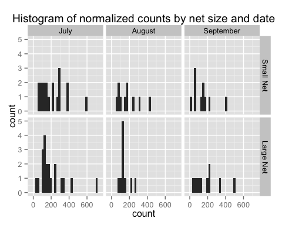
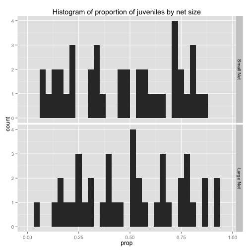
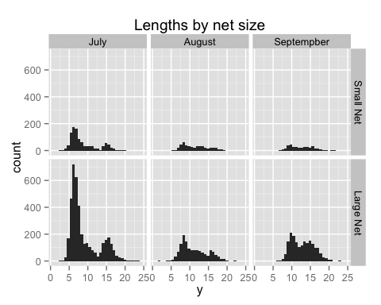
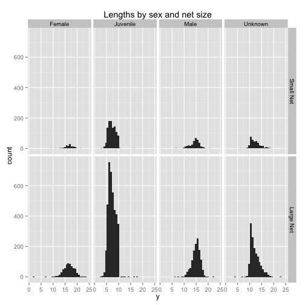
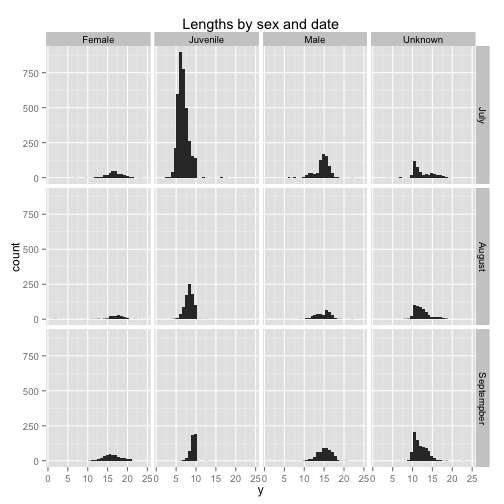

title: "Mysis analysis"
author: "John Tipton"
date: "October 12, 2015"
---
This document shows the analyses performed in Johnson et. al. We start by loading packages and define helper functions


## Model for Total counts for each net
We begin the analysis by loading the data used for measuring total count. At each sampling event $i$ we recorded the number of mysis shrimp caught and important covariates including date, site, net size, etc. 

```r
load("~/mysis/data/mysisCountData.RData")                                 ## load count data
mns <- by(mysisCountData[, "count"], mysisCountData[, "net"], mean)       ## mean of counts by net size
vars <- by(mysisCountData[, "count"], mysisCountData[, "net"], var)       ## variance of counts by net size
```

After loading the data, we can look at histograms of data to get a better understanding of what variables effect mysis shrimp count. First we examine the total counts broken down by net size and sampling month


```r
ggplot(data=mysisCountData, aes(count)) + geom_histogram() + facet_grid(net ~ date) + 
  ggtitle("Histogram of normalized counts by net size and date")
```



From these histograms, we see little differences between the two net sizes, except for perhaps a spike in catches of about 120 by the small net in August. We test this formally by fitting a model to compare if the count of shrimp caught by the large net is the same as the count of shrimp caught by the large net, after normalizing for the area of the two nets and controlling for covariates. Because counts cannot be less that zero and often are right skewed, the assumption of Normality in the data is questionable. Hence, we don't want to use Gaussian methods like linear regression and ANOVA. Luckily, the class of models known a generalized linear models (or glms) offers a solution. These models allow for regression models that control for the effects of covariates like linear regression but do not assume the normal distribution. For count data, there are two natural distributions to use: the Poisson distribution and the negative binomial distribution. The Poisson distribution has the strong assumption that the mean equals the variance, which is often not met in practical datasets. In our data, the count means are $(182.3, 183.2)$ and the count variances are $(1.795 &times; 10<sup>4</sup>, 1.524 &times; 10<sup>4</sup>)$, for the small and large nets, respectively. Therefore we use a negative binomial model
$$
\label{neg:bin}
y_i \sim \mbox{NegBin}(\mu_i, \phi),
$$
where $\mu$ is the mean of the negative binomial distribution and $\phi$ is an overdispersion parameter that allows for the mean and variance to be different. We model $\mu$ with covariates using a log link function
$$ 
\mu_i = log(\mathbf{X}_i \boldsymbol{\beta}),
$$
where $\mathbf{X}_i$ is the set of covariates for observation $i$. Then we perform inference on our coefficients $\boldsymbol{\beta}$, where the interpretation of $\beta_j$ is a percent change in count per unit change in $X_{ij}$.

```r
## construct covariates of net size, date and their interaction
X <- model.matrix(~ net * date - 1, data=mysisCountData)  
## fit negative binomial model
summary(nbmod <- glm.nb(y ~ ., data = data.frame(y=mysisCountData$count, X)))
## get coefficient estimates
coefs <- c(nbmod$coefficients, nbmod$theta)           
```

To test for a change in total counts between the two net sizes, we construct a negative binomal regression model that examines the effects of net size, date of sampling and the interaction between net size and sampling date. The results shown below show that there is no evidence of an effect on the number of counts observed between the two net sizes (p=0.955).


```r
tableData <- cbind(summary(nbmod)$coeff[1:6, ])
colnames(tableData) <- c("Estimate", "Std. Error", "z value", "Pr(>|z|)")
rownames(tableData) <- c("Intercept", "Net Size", "August", "September", 
                         "Net Size * August", "Net Size * September")
kable(tableData, digits = 4, format="html")
```

<table>
 <thead>
  <tr>
   <th style="text-align:left;">   </th>
   <th style="text-align:right;"> Estimate </th>
   <th style="text-align:right;"> Std. Error </th>
   <th style="text-align:right;"> z value </th>
   <th style="text-align:right;"> Pr(&gt;|z|) </th>
  </tr>
 </thead>
<tbody>
  <tr>
   <td style="text-align:left;"> Intercept </td>
   <td style="text-align:right;"> 5.3132 </td>
   <td style="text-align:right;"> 0.139 </td>
   <td style="text-align:right;"> 38.1112 </td>
   <td style="text-align:right;"> 0.000 </td>
  </tr>
  <tr>
   <td style="text-align:left;"> Net Size </td>
   <td style="text-align:right;"> -0.0111 </td>
   <td style="text-align:right;"> 0.197 </td>
   <td style="text-align:right;"> -0.0565 </td>
   <td style="text-align:right;"> 0.955 </td>
  </tr>
  <tr>
   <td style="text-align:left;"> August </td>
   <td style="text-align:right;"> -0.3420 </td>
   <td style="text-align:right;"> 0.242 </td>
   <td style="text-align:right;"> -1.4138 </td>
   <td style="text-align:right;"> 0.157 </td>
  </tr>
  <tr>
   <td style="text-align:left;"> September </td>
   <td style="text-align:right;"> -0.0812 </td>
   <td style="text-align:right;"> 0.242 </td>
   <td style="text-align:right;"> -0.3360 </td>
   <td style="text-align:right;"> 0.737 </td>
  </tr>
  <tr>
   <td style="text-align:left;"> Net Size * August </td>
   <td style="text-align:right;"> 0.2459 </td>
   <td style="text-align:right;"> 0.342 </td>
   <td style="text-align:right;"> 0.7193 </td>
   <td style="text-align:right;"> 0.472 </td>
  </tr>
  <tr>
   <td style="text-align:left;"> Net Size * September </td>
   <td style="text-align:right;"> -0.2734 </td>
   <td style="text-align:right;"> 0.342 </td>
   <td style="text-align:right;"> -0.7997 </td>
   <td style="text-align:right;"> 0.424 </td>
  </tr>
</tbody>
</table>

## Model for counts by sex

The next question we wish to explore is whether the total counts when grouped into sex classes of male, female, juvenile, and unknown vary with net size or other covariates. To do this we use (\ref{eq:negBin}) above. We begin by loading the data where counts are divided into sex classes.


```r
## load data
load("~/mysis/data/mysisSexCountData.RData")   
## construct model matrix for covariates
X <- model.matrix(~ net * gender + net * date + gender * date-1, 
                  data=mysisSexCountData)
## fit model
nbmod <- glm.nb(y ~ ., data = data.frame(y=mysisSexCountData$count, X))
```

To explore this data in more detail we examine two sets of histograms, the counts of each sex class broken down by date in figure1 and the counts of each sex class broken down by net size in figure2. From these we see...


```r
ggplot(data=mysisSexCountData, aes(count)) +         
  geom_histogram() + facet_grid(net ~ gender) + 
  ggtitle("Histogram of normalized counts by sex and net size")
ggplot(data=mysisSexCountData, aes(count)) +
  geom_histogram() + facet_grid(gender ~ date) + 
  ggtitle("Histogram of normalized counts by sex and date")
```


To test for a change in counts broken down by gender category between the two net sizes, we construct a negative binomal regression model that examines the effects of net size, date of sampling, the interaction between net size and sampling date, and the interaction between sampling date and gender. The results shown below show that there is no evidence of an interaction between net size and sampling date and no evidence of an interaction between net size and gender. 


```r
tableData <- cbind(summary(nbmod)$coeff)
colnames(tableData) <- c("Estimate", "Std. Error", "z value", "Pr(>|z|)")
rownames(tableData) <- c("Intercept", "Net Size", "Females", "Juveniles", 
                         "Unknown Gender", "August", "September", 
                         "Net Size * Females", "Net Size * Juveniles", 
                         "Net Size * Unknowns", "Net Size * August",
                         "Net Size * September",
                         "Females * August", "Juveniles * August", 
                         "Unknown Gender * August",
                         "Females * September", "Juveniles * September", 
                         "Unknown Gender * September")
kable(tableData, digits = 4, format="html")
```

<table>
 <thead>
  <tr>
   <th style="text-align:left;">   </th>
   <th style="text-align:right;"> Estimate </th>
   <th style="text-align:right;"> Std. Error </th>
   <th style="text-align:right;"> z value </th>
   <th style="text-align:right;"> Pr(&gt;|z|) </th>
  </tr>
 </thead>
<tbody>
  <tr>
   <td style="text-align:left;"> Intercept </td>
   <td style="text-align:right;"> 3.3587 </td>
   <td style="text-align:right;"> 0.158 </td>
   <td style="text-align:right;"> 21.285 </td>
   <td style="text-align:right;"> 0.0000 </td>
  </tr>
  <tr>
   <td style="text-align:left;"> Net Size </td>
   <td style="text-align:right;"> 0.0678 </td>
   <td style="text-align:right;"> 0.196 </td>
   <td style="text-align:right;"> 0.347 </td>
   <td style="text-align:right;"> 0.7287 </td>
  </tr>
  <tr>
   <td style="text-align:left;"> Females </td>
   <td style="text-align:right;"> -1.2668 </td>
   <td style="text-align:right;"> 0.220 </td>
   <td style="text-align:right;"> -5.755 </td>
   <td style="text-align:right;"> 0.0000 </td>
  </tr>
  <tr>
   <td style="text-align:left;"> Juveniles </td>
   <td style="text-align:right;"> 1.5758 </td>
   <td style="text-align:right;"> 0.212 </td>
   <td style="text-align:right;"> 7.436 </td>
   <td style="text-align:right;"> 0.0000 </td>
  </tr>
  <tr>
   <td style="text-align:left;"> Unknown Gender </td>
   <td style="text-align:right;"> -0.5729 </td>
   <td style="text-align:right;"> 0.216 </td>
   <td style="text-align:right;"> -2.657 </td>
   <td style="text-align:right;"> 0.0079 </td>
  </tr>
  <tr>
   <td style="text-align:left;"> August </td>
   <td style="text-align:right;"> 0.1567 </td>
   <td style="text-align:right;"> 0.239 </td>
   <td style="text-align:right;"> 0.655 </td>
   <td style="text-align:right;"> 0.5127 </td>
  </tr>
  <tr>
   <td style="text-align:left;"> September </td>
   <td style="text-align:right;"> 0.1468 </td>
   <td style="text-align:right;"> 0.239 </td>
   <td style="text-align:right;"> 0.615 </td>
   <td style="text-align:right;"> 0.5387 </td>
  </tr>
  <tr>
   <td style="text-align:left;"> Net Size * Females </td>
   <td style="text-align:right;"> 0.3123 </td>
   <td style="text-align:right;"> 0.252 </td>
   <td style="text-align:right;"> 1.240 </td>
   <td style="text-align:right;"> 0.2151 </td>
  </tr>
  <tr>
   <td style="text-align:left;"> Net Size * Juveniles </td>
   <td style="text-align:right;"> 0.0037 </td>
   <td style="text-align:right;"> 0.245 </td>
   <td style="text-align:right;"> 0.015 </td>
   <td style="text-align:right;"> 0.9880 </td>
  </tr>
  <tr>
   <td style="text-align:left;"> Net Size * Unknowns </td>
   <td style="text-align:right;"> 0.0879 </td>
   <td style="text-align:right;"> 0.247 </td>
   <td style="text-align:right;"> 0.355 </td>
   <td style="text-align:right;"> 0.7224 </td>
  </tr>
  <tr>
   <td style="text-align:left;"> Net Size * August </td>
   <td style="text-align:right;"> -0.3157 </td>
   <td style="text-align:right;"> 0.215 </td>
   <td style="text-align:right;"> -1.467 </td>
   <td style="text-align:right;"> 0.1425 </td>
  </tr>
  <tr>
   <td style="text-align:left;"> Net Size * September </td>
   <td style="text-align:right;"> 0.2531 </td>
   <td style="text-align:right;"> 0.214 </td>
   <td style="text-align:right;"> 1.180 </td>
   <td style="text-align:right;"> 0.2380 </td>
  </tr>
  <tr>
   <td style="text-align:left;"> Females * August </td>
   <td style="text-align:right;"> 0.3251 </td>
   <td style="text-align:right;"> 0.309 </td>
   <td style="text-align:right;"> 1.052 </td>
   <td style="text-align:right;"> 0.2929 </td>
  </tr>
  <tr>
   <td style="text-align:left;"> Juveniles * August </td>
   <td style="text-align:right;"> -0.7032 </td>
   <td style="text-align:right;"> 0.300 </td>
   <td style="text-align:right;"> -2.342 </td>
   <td style="text-align:right;"> 0.0192 </td>
  </tr>
  <tr>
   <td style="text-align:left;"> Unknown Gender * August </td>
   <td style="text-align:right;"> 1.0094 </td>
   <td style="text-align:right;"> 0.303 </td>
   <td style="text-align:right;"> 3.332 </td>
   <td style="text-align:right;"> 0.0009 </td>
  </tr>
  <tr>
   <td style="text-align:left;"> Females * September </td>
   <td style="text-align:right;"> 0.5445 </td>
   <td style="text-align:right;"> 0.306 </td>
   <td style="text-align:right;"> 1.779 </td>
   <td style="text-align:right;"> 0.0753 </td>
  </tr>
  <tr>
   <td style="text-align:left;"> Juveniles * September </td>
   <td style="text-align:right;"> -1.5523 </td>
   <td style="text-align:right;"> 0.300 </td>
   <td style="text-align:right;"> -5.166 </td>
   <td style="text-align:right;"> 0.0000 </td>
  </tr>
  <tr>
   <td style="text-align:left;"> Unknown Gender * September </td>
   <td style="text-align:right;"> 0.9672 </td>
   <td style="text-align:right;"> 0.302 </td>
   <td style="text-align:right;"> 3.204 </td>
   <td style="text-align:right;"> 0.0014 </td>
  </tr>
</tbody>
</table>

Thus, we refit the model without the interaction between net size and sampling date. To do this we start by loading the new covariate matrix $\mathbf{X}$.


On this reduced model, the results shown below show that there is no evidence of an effect on the number of counts observed between the two net sizes (p=0.636).

```r
tableData <- cbind(summary(nbmod)$coeff)
colnames(tableData) <- c("Estimate", "Std. Error", "z value", "Pr(>|z|)")
rownames(tableData) <- c("Intercept", "Net Size", "Females", "Juveniles", 
                         "Unknown Gender", "August", "September", 
                         "Net Size * Females", "Net Size * Juveniles", 
                         "Net Size * Unknowns", 
                         "Females * August", "Juveniles * August", 
                         "Unknown Gender * August",
                         "Females * September", "Juveniles * September", 
                         "Unknown Gender * September")
kable(tableData, digits = 4, format="html")
```

<table>
 <thead>
  <tr>
   <th style="text-align:left;">   </th>
   <th style="text-align:right;"> Estimate </th>
   <th style="text-align:right;"> Std. Error </th>
   <th style="text-align:right;"> z value </th>
   <th style="text-align:right;"> Pr(&gt;|z|) </th>
  </tr>
 </thead>
<tbody>
  <tr>
   <td style="text-align:left;"> Intercept </td>
   <td style="text-align:right;"> 3.4341 </td>
   <td style="text-align:right;"> 0.152 </td>
   <td style="text-align:right;"> 22.5222 </td>
   <td style="text-align:right;"> 0.0000 </td>
  </tr>
  <tr>
   <td style="text-align:left;"> Net Size </td>
   <td style="text-align:right;"> -0.0834 </td>
   <td style="text-align:right;"> 0.176 </td>
   <td style="text-align:right;"> -0.4739 </td>
   <td style="text-align:right;"> 0.6356 </td>
  </tr>
  <tr>
   <td style="text-align:left;"> Females </td>
   <td style="text-align:right;"> -1.2681 </td>
   <td style="text-align:right;"> 0.222 </td>
   <td style="text-align:right;"> -5.7202 </td>
   <td style="text-align:right;"> 0.0000 </td>
  </tr>
  <tr>
   <td style="text-align:left;"> Juveniles </td>
   <td style="text-align:right;"> 1.5772 </td>
   <td style="text-align:right;"> 0.214 </td>
   <td style="text-align:right;"> 7.3834 </td>
   <td style="text-align:right;"> 0.0000 </td>
  </tr>
  <tr>
   <td style="text-align:left;"> Unknown Gender </td>
   <td style="text-align:right;"> -0.5726 </td>
   <td style="text-align:right;"> 0.217 </td>
   <td style="text-align:right;"> -2.6358 </td>
   <td style="text-align:right;"> 0.0084 </td>
  </tr>
  <tr>
   <td style="text-align:left;"> August </td>
   <td style="text-align:right;"> 0.0092 </td>
   <td style="text-align:right;"> 0.216 </td>
   <td style="text-align:right;"> 0.0425 </td>
   <td style="text-align:right;"> 0.9661 </td>
  </tr>
  <tr>
   <td style="text-align:left;"> September </td>
   <td style="text-align:right;"> 0.2911 </td>
   <td style="text-align:right;"> 0.215 </td>
   <td style="text-align:right;"> 1.3543 </td>
   <td style="text-align:right;"> 0.1756 </td>
  </tr>
  <tr>
   <td style="text-align:left;"> Net Size * Females </td>
   <td style="text-align:right;"> 0.3160 </td>
   <td style="text-align:right;"> 0.254 </td>
   <td style="text-align:right;"> 1.2454 </td>
   <td style="text-align:right;"> 0.2130 </td>
  </tr>
  <tr>
   <td style="text-align:left;"> Net Size * Juveniles </td>
   <td style="text-align:right;"> 0.0019 </td>
   <td style="text-align:right;"> 0.247 </td>
   <td style="text-align:right;"> 0.0079 </td>
   <td style="text-align:right;"> 0.9937 </td>
  </tr>
  <tr>
   <td style="text-align:left;"> Net Size * Unknowns </td>
   <td style="text-align:right;"> 0.0877 </td>
   <td style="text-align:right;"> 0.249 </td>
   <td style="text-align:right;"> 0.3516 </td>
   <td style="text-align:right;"> 0.7252 </td>
  </tr>
  <tr>
   <td style="text-align:left;"> Females * August </td>
   <td style="text-align:right;"> 0.3390 </td>
   <td style="text-align:right;"> 0.311 </td>
   <td style="text-align:right;"> 1.0891 </td>
   <td style="text-align:right;"> 0.2761 </td>
  </tr>
  <tr>
   <td style="text-align:left;"> Juveniles * August </td>
   <td style="text-align:right;"> -0.7198 </td>
   <td style="text-align:right;"> 0.303 </td>
   <td style="text-align:right;"> -2.3784 </td>
   <td style="text-align:right;"> 0.0174 </td>
  </tr>
  <tr>
   <td style="text-align:left;"> Unknown Gender * August </td>
   <td style="text-align:right;"> 1.0143 </td>
   <td style="text-align:right;"> 0.305 </td>
   <td style="text-align:right;"> 3.3231 </td>
   <td style="text-align:right;"> 0.0009 </td>
  </tr>
  <tr>
   <td style="text-align:left;"> Females * September </td>
   <td style="text-align:right;"> 0.5426 </td>
   <td style="text-align:right;"> 0.308 </td>
   <td style="text-align:right;"> 1.7596 </td>
   <td style="text-align:right;"> 0.0785 </td>
  </tr>
  <tr>
   <td style="text-align:left;"> Juveniles * September </td>
   <td style="text-align:right;"> -1.5839 </td>
   <td style="text-align:right;"> 0.303 </td>
   <td style="text-align:right;"> -5.2294 </td>
   <td style="text-align:right;"> 0.0000 </td>
  </tr>
  <tr>
   <td style="text-align:left;"> Unknown Gender * September </td>
   <td style="text-align:right;"> 0.9655 </td>
   <td style="text-align:right;"> 0.304 </td>
   <td style="text-align:right;"> 3.1741 </td>
   <td style="text-align:right;"> 0.0015 </td>
  </tr>
</tbody>
</table>

## Model for proportion of juveniles


```r
ggplot(data=data, aes(prop)) + geom_histogram() + facet_grid(net ~ .) + 
  ggtitle("Histogram of proportion of juveniles by net size")
```



To test for a change in the proportion of juveniles caught between the two net sizes, we construct a beta regression model that examines the effects of net size, date of sampling and the interaction between net size and sampling date. The results shown below show that there is no evidence of an effect on the proportion of juveniles caught between the two net sizes (p=0.783).


```r
tableData <- cbind(summary(brmod)$coeff$mean)
colnames(tableData) <- c("Estimate", "Std. Error", "z value", "Pr(>|z|)")
rownames(tableData) <- c("Intercept", "Net Size", "August", "September", 
                         "Net Size * August", "Net Size * September")
kable(tableData, digits = 4, format="html")
```

<table>
 <thead>
  <tr>
   <th style="text-align:left;">   </th>
   <th style="text-align:right;"> Estimate </th>
   <th style="text-align:right;"> Std. Error </th>
   <th style="text-align:right;"> z value </th>
   <th style="text-align:right;"> Pr(&gt;|z|) </th>
  </tr>
 </thead>
<tbody>
  <tr>
   <td style="text-align:left;"> Intercept </td>
   <td style="text-align:right;"> 0.6326 </td>
   <td style="text-align:right;"> 0.155 </td>
   <td style="text-align:right;"> 4.093 </td>
   <td style="text-align:right;"> 0.0000 </td>
  </tr>
  <tr>
   <td style="text-align:left;"> Net Size </td>
   <td style="text-align:right;"> 0.0602 </td>
   <td style="text-align:right;"> 0.219 </td>
   <td style="text-align:right;"> 0.276 </td>
   <td style="text-align:right;"> 0.7829 </td>
  </tr>
  <tr>
   <td style="text-align:left;"> August </td>
   <td style="text-align:right;"> -0.9367 </td>
   <td style="text-align:right;"> 0.263 </td>
   <td style="text-align:right;"> -3.566 </td>
   <td style="text-align:right;"> 0.0004 </td>
  </tr>
  <tr>
   <td style="text-align:left;"> September </td>
   <td style="text-align:right;"> -2.0965 </td>
   <td style="text-align:right;"> 0.296 </td>
   <td style="text-align:right;"> -7.092 </td>
   <td style="text-align:right;"> 0.0000 </td>
  </tr>
  <tr>
   <td style="text-align:left;"> Net Size * August </td>
   <td style="text-align:right;"> -0.2113 </td>
   <td style="text-align:right;"> 0.372 </td>
   <td style="text-align:right;"> -0.568 </td>
   <td style="text-align:right;"> 0.5703 </td>
  </tr>
  <tr>
   <td style="text-align:left;"> Net Size * September </td>
   <td style="text-align:right;"> 0.5523 </td>
   <td style="text-align:right;"> 0.399 </td>
   <td style="text-align:right;"> 1.383 </td>
   <td style="text-align:right;"> 0.1666 </td>
  </tr>
</tbody>
</table>

## Length model


```r
ggplot(data=mysisLengthData, aes(y)) + geom_histogram() + facet_grid(net ~ date) +
  ggtitle("Lengths by net size")
ggplot(data=mysisLengthData, aes(y)) + geom_histogram() + facet_grid(net ~ gender) + 
  ggtitle("Lengths by sex and net size")
ggplot(data=mysisLengthData, aes(y)) + geom_histogram() + facet_grid(date ~ gender) + 
  ggtitle("Lengths by sex and date")
```




```r
tableData <- cbind(summary(rlmmod)$coeff, pvalues)
colnames(tableData) <- c("Estimate", "Std. Error", "z value", "Pr(>|z|)")
rownames(tableData) <- c("Intercept", "Net Size", "Females", "Juveniles", 
                         "Unknown Gender", "August", "September", 
                         "Females * August", "Juveniles * August", 
                         "Unknown Gender * August",
                         "Females * September", "Juveniles * September", 
                         "Unknown Gender * September")

kable(tableData, digits = 4, format="html")
```

<table>
 <thead>
  <tr>
   <th style="text-align:left;">   </th>
   <th style="text-align:right;"> Estimate </th>
   <th style="text-align:right;"> Std. Error </th>
   <th style="text-align:right;"> z value </th>
   <th style="text-align:right;"> Pr(&gt;|z|) </th>
  </tr>
 </thead>
<tbody>
  <tr>
   <td style="text-align:left;"> Intercept </td>
   <td style="text-align:right;"> 16.683 </td>
   <td style="text-align:right;"> 0.0924 </td>
   <td style="text-align:right;"> 180.46 </td>
   <td style="text-align:right;"> 0.0000 </td>
  </tr>
  <tr>
   <td style="text-align:left;"> Net Size </td>
   <td style="text-align:right;"> 0.103 </td>
   <td style="text-align:right;"> 0.0378 </td>
   <td style="text-align:right;"> 2.73 </td>
   <td style="text-align:right;"> 0.0063 </td>
  </tr>
  <tr>
   <td style="text-align:left;"> Females </td>
   <td style="text-align:right;"> 0.500 </td>
   <td style="text-align:right;"> 0.1447 </td>
   <td style="text-align:right;"> 3.46 </td>
   <td style="text-align:right;"> 0.0006 </td>
  </tr>
  <tr>
   <td style="text-align:left;"> Juveniles </td>
   <td style="text-align:right;"> -0.700 </td>
   <td style="text-align:right;"> 0.1167 </td>
   <td style="text-align:right;"> -6.00 </td>
   <td style="text-align:right;"> 0.0000 </td>
  </tr>
  <tr>
   <td style="text-align:left;"> Unknown Gender </td>
   <td style="text-align:right;"> -10.114 </td>
   <td style="text-align:right;"> 0.0900 </td>
   <td style="text-align:right;"> -112.37 </td>
   <td style="text-align:right;"> 0.0000 </td>
  </tr>
  <tr>
   <td style="text-align:left;"> August </td>
   <td style="text-align:right;"> -1.950 </td>
   <td style="text-align:right;"> 0.1020 </td>
   <td style="text-align:right;"> -19.11 </td>
   <td style="text-align:right;"> 0.0000 </td>
  </tr>
  <tr>
   <td style="text-align:left;"> September </td>
   <td style="text-align:right;"> -4.753 </td>
   <td style="text-align:right;"> 0.1107 </td>
   <td style="text-align:right;"> -42.92 </td>
   <td style="text-align:right;"> 0.0000 </td>
  </tr>
  <tr>
   <td style="text-align:left;"> Females * August </td>
   <td style="text-align:right;"> 1.103 </td>
   <td style="text-align:right;"> 0.1547 </td>
   <td style="text-align:right;"> 7.13 </td>
   <td style="text-align:right;"> 0.0000 </td>
  </tr>
  <tr>
   <td style="text-align:left;"> Juveniles * August </td>
   <td style="text-align:right;"> 3.242 </td>
   <td style="text-align:right;"> 0.1364 </td>
   <td style="text-align:right;"> 23.77 </td>
   <td style="text-align:right;"> 0.0000 </td>
  </tr>
  <tr>
   <td style="text-align:left;"> Unknown Gender * August </td>
   <td style="text-align:right;"> -0.504 </td>
   <td style="text-align:right;"> 0.1731 </td>
   <td style="text-align:right;"> -2.91 </td>
   <td style="text-align:right;"> 0.0036 </td>
  </tr>
  <tr>
   <td style="text-align:left;"> Females * September </td>
   <td style="text-align:right;"> 1.117 </td>
   <td style="text-align:right;"> 0.1427 </td>
   <td style="text-align:right;"> 7.83 </td>
   <td style="text-align:right;"> 0.0000 </td>
  </tr>
  <tr>
   <td style="text-align:left;"> Juveniles * September </td>
   <td style="text-align:right;"> -0.397 </td>
   <td style="text-align:right;"> 0.1716 </td>
   <td style="text-align:right;"> -2.31 </td>
   <td style="text-align:right;"> 0.0207 </td>
  </tr>
  <tr>
   <td style="text-align:left;"> Unknown Gender * September </td>
   <td style="text-align:right;"> 0.537 </td>
   <td style="text-align:right;"> 0.1442 </td>
   <td style="text-align:right;"> 3.72 </td>
   <td style="text-align:right;"> 0.0002 </td>
  </tr>
</tbody>
</table>


```r
SD <- sqrt(((sum(mysisLengthData$net == "Large Net") - 1) *
              sd(mysisLengthData$y[mysisLengthData$net == "Large Net"])^2 + 
              (sum(mysisLengthData$net == "Small Net") - 1) *
              sd(mysisLengthData$y[mysisLengthData$net == "Small Net"])^2) / 
             (sum(mysisLengthData$net == "Large Net") + 
                sum(mysisLengthData$net == "Small Net")))

d <- (mean(mysisLengthData$y[mysisLengthData$net == "Large Net"]) - 
        mean(mysisLengthData$y[mysisLengthData$net == "Small Net"])) / SD
```
We see that there is a significant effect of net size on mean length caught (p = 0.006) after controlling for date, gender class, and an interaction between date and gender class. Although this is statisticallly significant, the effect size is small (0.103mm) and the sample size is large (n = 9127). given a large sample size, a hypothesis test will show staistical significance unless the population effect size is exactly zero (this explains why all of the p-values in the table above are less than 0.05). Therefore, the practical effect of a difference in mean length of 0.103mm on a species with a mean length of 10.351mm is small (this is the smallest effect of all the effects estimated by almost a factor of two) and a difference in means of this size is not of practical interest.


